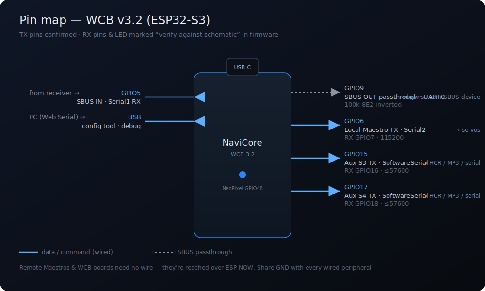

# Hardware and Wiring

NaviCore runs on a **WCB v3.2** board (Espressif **ESP32‑S3**). This page covers the pin assignments and how to wire the receiver and peripherals.

> ⚠️ **Pin caveat.** The firmware's **TX** pins below are authoritative (they match the WCB 3.2 pin map and are confirmed in code). Some **RX** pins and the status‑LED pin are marked *"verify against schematic"* in the source — they are the firmware's defaults but you should confirm against your board before soldering to an RX pad. The SBUS‑in pin (GPIO5) is confirmed.

---

## Pin map (ESP32‑S3 / WCB 3.2)

| Function | UART | Pin | Notes |
|----------|------|-----|-------|
| **SBUS IN** | Serial1 / UART1 RX | **GPIO5** | From RC receiver. RX‑only (TX disabled). Confirmed. |
| **SBUS OUT** (passthrough) | Serial0 / UART0 TX | **GPIO9** | 100k 8E2 **inverted**, TX‑only. Re‑emits the received frame. |
| **Local Maestro** | Serial2 / UART2 | TX **GPIO6**, RX **GPIO7** | Pololu Maestro command bus. Default 115200 baud. RX optional. |
| **Aux serial S3** | SoftwareSerial | TX **GPIO15**, RX **GPIO16** | HCR / MP3 / generic serial. ≤57600 baud. |
| **Aux serial S4** | SoftwareSerial | TX **GPIO17**, RX **GPIO18** | HCR / MP3 / generic serial. ≤57600 baud. |
| **Status LED** | — | **GPIO48** | Onboard NeoPixel (verify against schematic). |
| **USB (debug + config tool)** | native USB‑CDC | USB‑C | No UART consumed. 115200. |

The ESP32‑S3 has only three hardware UARTs. With the debug console on native USB‑CDC, they're allocated as: **UART0 → SBUS OUT**, **UART1 → SBUS IN**, **UART2 → local Maestro**. That leaves no spare hardware UART, so **S3/S4 are bit‑banged** (SoftwareSerial) — which is why they're capped at ~57600 baud.

---

## SBUS input

- Wire the receiver's **SBUS** signal to **GPIO5**, plus **GND** and the receiver's supply (per your receiver's spec — typically 5 V).
- SBUS is inverted UART at 100000 baud, 8E2 — the firmware handles inversion internally; just feed it the raw SBUS line.
- **16‑ and 24‑channel** SBUS are auto‑detected (25‑byte vs 36‑byte frames). You'll see the detected variant in the config tool's monitor and via the `#L09` / `#L13` CLI commands.

## SBUS output (passthrough)

- **GPIO9** re‑emits the exact channel data received, so you can daisy‑chain a downstream SBUS consumer (another controller, a servo decoder, etc.).
- It is a byte‑for‑byte passthrough on its own hardware UART — no added latency to speak of (~1 µs per byte FIFO push).
- This pin is **reserved** — it is *not* selectable as a serial action target (the old "S5" slot).

## Local Maestro bus

- Connect the Pololu Maestro's **RX** to **GPIO6** (NaviCore TX), and **GND** common.
- Default baud **115200**. Each wired Maestro must either be set to that fixed baud in **Maestro Control Center → Serial Settings**, or be in **Detect Baud Rate** mode.
- NaviCore always speaks **Pololu protocol** (not compact), so **every Maestro must have a unique device number** (0–127) set in Maestro Control Center. This is what lets multiple Maestros share one bus (and the ESP‑NOW broadcast bus) without all responding to every command.
- Configure which logical Maestro (slot **1–8**) is *local* vs *remote*, and its device number, in the config tool's **Maestro Locations** panel. See [[Actions Reference]].

## Aux serial (S3 / S4)

Two general‑purpose SoftwareSerial ports for:
- an **HCR vocalizer** (9600 baud),
- a **SparkFun MP3 Trigger v2** (38400 baud),
- or any device you drive with raw **Serial** actions.

Wire NaviCore **TX → device RX** (GPIO15 for S3, GPIO17 for S4), share **GND**, and set the matching baud in **Config → Aux Serial**. One port = one device = one baud. Keep ≤ 57600.

## Remote peripherals (no wiring to NaviCore)

Remote **Maestros** and **WCB** boards are reached over **ESP‑NOW** — there's no physical wire from NaviCore to them. NaviCore broadcasts Maestro bytes on the Kyber path; any WCB with **Kyber_Remote** enabled forwards them to its own Maestro port. See [[WCB Network]].

## Power & status LED

- Power the board per the WCB 3.2 hardware spec.
- The onboard NeoPixel shows boot/run state:
  - **Red** — booting
  - **Orange** — WCB network failed to initialize (check [[WCB Network]] settings)
  - **Dim blue** — running normally

---

### Next: [[Flashing the Firmware]] · [[Transmitter Setup]]
