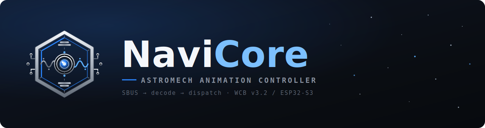
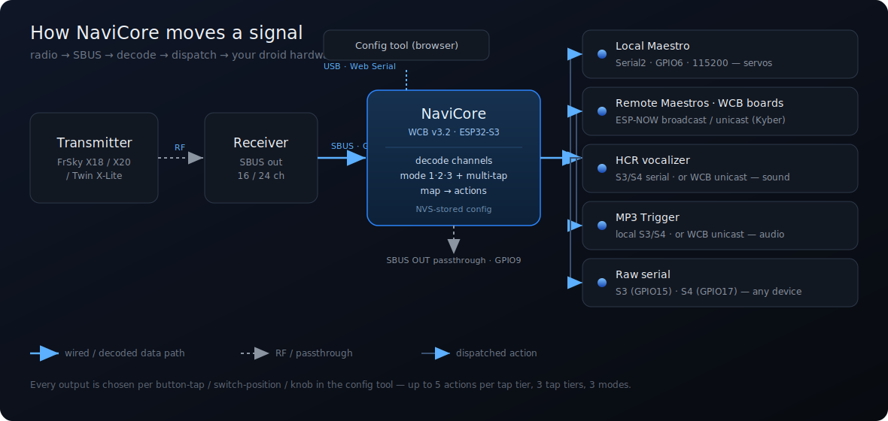

# NaviCore Wiki

**NaviCore** — *Astromech Animation Controller.* A WCB-based RC controller for ESP32‑S3 (WCB hardware v3.2). It reads **SBUS** from an FrSky receiver and dispatches matrix buttons, switches, and knobs to local & remote Pololu Maestros, WCB boards, HCR vocalizers, and MP3 triggers — over a hardware serial bus and ESP‑NOW. A browser‑based config tool (Web Serial) handles all setup.

> Formerly *RC‑Controller* / *HyperCore*.

---

## Quick start

1. **Flash the firmware** to a WCB v3.2 board → [[Flashing the Firmware]]
2. **Wire it up** — receiver SBUS in, Maestro / aux serial / SBUS passthrough out → [[Hardware and Wiring]]
3. **Load the transmitter model** onto your FrSky radio → [[Transmitter Setup]]
4. **Open the config tool**, connect over USB, and map your controls → [[Config Tool Guide]]

---

## Documentation

| Page | What's in it |
|------|--------------|
| [[Hardware and Wiring]] | Board, pin map, receiver/SBUS, Maestro bus, aux serial, power |
| [[Flashing the Firmware]] | In‑browser flasher, Arduino IDE, CI builds, versioning |
| [[Transmitter Setup]] | X18 / X20 / Twin X‑Lite, channel map, loading the model file |
| [[Config Tool Guide]] | Connecting, the live monitor, buttons/switches/knobs, modes, multi‑tap, calibration, save/load |
| [[Actions Reference]] | WCB, Maestro, HCR, MP3, Serial — every action type and its parameters |
| [[WCB Network]] | ESP‑NOW credentials, device IDs, remote Maestros, "Via WCB" |
| [[Serial JSON Protocol]] | Full USB command table for tooling / scripting |
| [[CLI Commands]] | `#Lxx` serial debug commands |
| [[Troubleshooting]] | No SBUS, port won't connect, save NACKs, HCR silent, Via‑WCB issues |

---

## How it works (one paragraph)

The transmitter multiplexes its physical buttons onto a single SBUS channel (the **matrix channel**, default CH7) as discrete PWM bands, and its switches/knobs onto their own channels. NaviCore decodes each SBUS frame, figures out which button was pressed (and how many times — single/double/triple tap), which **mode** the mode‑switch is in (1/2/3), and fires the **actions** you mapped to that button‑in‑that‑mode. Actions go out to a local Maestro on a hardware UART, to remote Maestros/WCBs over ESP‑NOW, to an HCR vocalizer or MP3 trigger, or to a raw serial port. The whole mapping lives in the board's NVS and is edited entirely from the browser config tool.

---

## Hardware target

- **Board:** WCB v3.2 (Espressif **ESP32‑S3**)
- **Input:** SBUS (16 or 24 channel, auto‑detected)
- **Firmware version scheme:** `vMAJOR.MINOR.PATCH_<DTG>` (e.g. `v0.2.0_011009QJUN26`) — see [[Flashing the Firmware]]

## License

MIT. See the `LICENSE` file in the repository.
